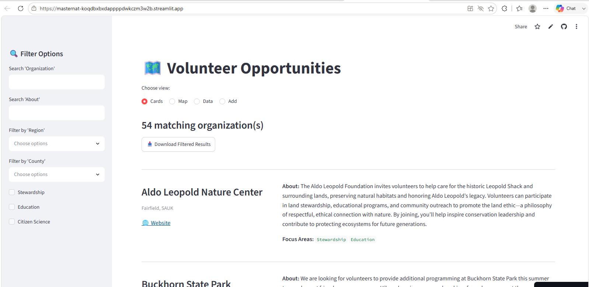
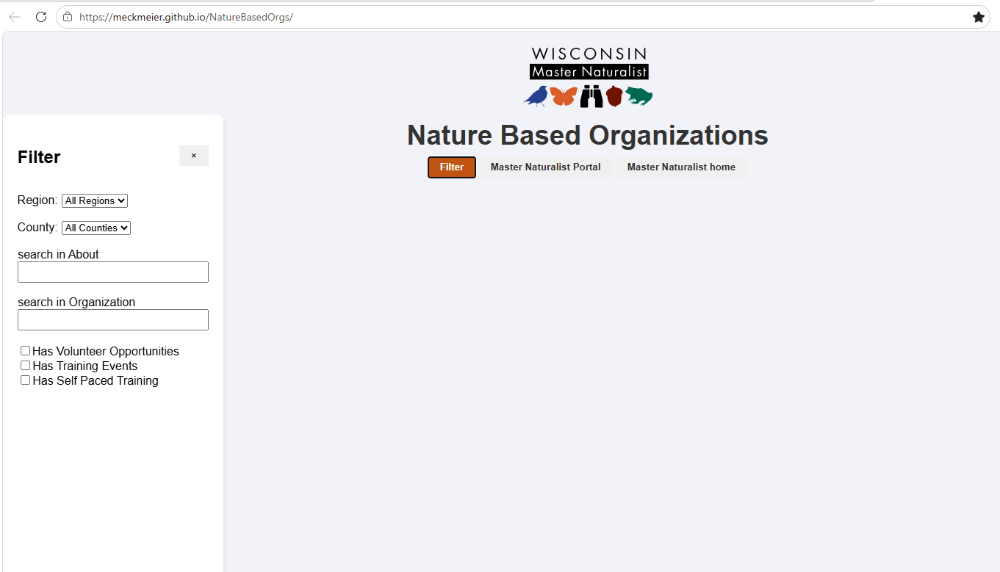

# WildPaths Development History

**Version 0.4 (Working Draft)**

# Introduction

The WildPaths story in not really one about a software project.

It really began with a practical problem. Master Naturalist folk were collecting
 volunteer opportunities, and advanced training -- storing it in a PDF and
 publishing it on their portal site. Keeping it current was a job. As the list grew long 
 it was harder for users to actually find the opportunities. So it started with
 wanting to make the job of maintaining the list easier and more consistent. Plus the
 added benefit of help users actually find the opportunities that excited them.

The original goal was **not** to build an application. In fact, every
effort was made to avoid building one. If we could solve it by 
using familiar tools ---such as Google Sheets or
Google Sites---that's what we wanted to do. Plus as a non-profit it was important
to keep the solution inexpensive and self-maintaining.

We started testing out ideas. Each idea told me something new and valuable about what was needed. Coupled
with the fact that I was just interested in this idea -- how can you take data and present it on the web -- had
 pestered me in my previous career. It wasn't something I had to solve in my job but I thought
 it would be fun to see what it really takes. 

------------------------------------------------------------------------

# Part I -- Exploration

## Streamlit -- Can the idea work? (July 2025)

As a database guy, the first thing I did was adjust the current list of opportunities into
a table. Now that I had data - I could do a lot of different things with it. First cut was to generate 
the PDF from a google sheet. This was not very exciting to me, as the end user, because I still 
couldn't really search the site. I used Streamlit (primarily because they had the free community site where 
we could publish the final view - at no cost to Master Naturalists. The objective
was to determine whether a modern, searchable interface would make the
information significantly more useful.

 

It did.

Searching, filtering, and card-based layouts showed the
value of an interactive experience. Building this site was so fast - and it was right there on the web for all to use.
However, keeping the underlying
 csv file current proved had issues. Ultimately I decided that getting the updated data involved too much technical work 
 for the staff so I went searching for other solutions. I will say this layout and interface became the gold standard for 
 a presentation. 

That shifted the project toward solving the data-management problem.

## HTML/CSV -- No fancy tools (August 2025)

I put the data aside for the moment. Staff was currently getting opportunity data from a Google form and it was stored in a GoogleSheet.
Staff would then take that sheet and build out a PDF file. What if all I did was simplify that... put a Googlesheet into CSV and send it 
into a HTML reader that would layout the data. While I wouldn't solve every problem, at least we would solve some of the work that the 
staff needed to do. I knew I could host GitHub pages for free off GitHub and that might just be a fine way to do this...

  

This solution has so much promise. It was cheap (or free!). It didn't change anything about how they maintained their data. It introduced 
no fancy tools. Straight up HTML and Javascript to load the data. But to make it work, I had to adjust the data model of the google sheet to 
the point that maintaining the data in a Google Sheet just got overwhelming. Plus I still didn't have a great interface. It was workable. And 
certainly better. But the data management issue because the sticking point.

We spent a certain amount of time trying to see if this idea - of hosting a relatively simple web interface inside the University system 
might work. But this also resulted in some dead ends. And technical conversations no one wanted to have. 

## Google Apps Script (Sept 2025)

So now the data is in Google Sheets. So I explored the Google universe to see if there was a good 
way to use the sheet as data and just present it via Google world. 

The goal was to "leverage an existing workflow" instead of introducing new
technology. If staff could continue maintaining the
date in a familiar environment, adoption would be much easier. The other issue that presented here was the need to find 
a hosting environment. Master Naturalist is a part of the University of Wisconsin Extension and I wanted them to own the final solution. 
That meant finding tools or platforms that could be hosted inside their current tech stack. Our first cut was Google.

Here there were two problems. One was that a single google sheet flattened to accomodate all the data while great for presentation was a 
little tricky for maintenance. I started to build out organization sheets, plus activity sheets that linked back. Not perfect but it could work. However, the
second problem was that the Google Site tool just didn't give me enough control over the layout. As soon as I wanted to do something a little bit 
different than "out of the box" presentation I ran into costs. Not surprising.

 

## CS50 (Sep 2025 -- Jan 2026)

Every prototype was an attempt to avoid unnecessary complexity. All the tries above... they told me that to do what I wanted 
really involved a framework. I needed a backend database to store the data and to capture the data, and a frontend to present it. 
Since there didn't seem to be a way to solve the problem without that structure, I decided to take the CS50 Web Development Class. 
It was a free class offered by Harvard. That class used Django so that is the framework I went with. I had a lot of conversations 
with ChatGPT to try and see if a better framework existed, but since I know had some familiarity with it, and there were inexpensive 
hosting options. Not free, but not too expensive. Given all that I found it became clear that this tool was not going to live at the Master 
Naturalists, but rather I would have to own it. And while I wasn't sure that was the most sustainable solution for them, I was so 
intrigued by finding out if I really could build out this thing, I decided to take it on. 

After completing the CS50 class, I wanted to recreate the basic Streamlit interface so that
using Django. It seemed relatively straightforward (a csv file that showed each row as a card with some filtering options), 
but to implement required the following:

    * datamodel - done in sqllite : Organization, OrgLocation, Event.
    * registration/login/logout with standard Django user model
    * forms to build filter-form, input form for org and event
    * bootstrap menu

https://www.youtube.com/watch?v=j7pzoyLu--s

------------------------------------------------------------------------

# Part III -- Building WildPaths
## March 15, 2026-July 2026

This period was spent taking that django project, and refining it slightly. And also figuring out how to get it into a hosted environment. 
Using Render's free service, I migrated the database to PostGre, added some additional Event details, and refined the pages. The process of 
exploring all the different elements of going from a class capstone project to actually deploying a site that Becky could look at and respond to 
took as much time as building the initial prototype. Welcome to web development. What I learned here is that the coordination of tools, frameworks, 
site management, etc. all that stuff takes a long time to learn. By March 15, I was sending the site to render for deployment.
    
* Mar 26: Canopy app; model has evolved to use Activities/Sessions and Location is decoupled from Organization.
* Apr 4: renamed to WildPathsWI
* Apr 14: added site policy and privacy settings - it's now built to be a professional site.
* Apr 15: Meeting with Becky to be ready to show the site to the test organization managers.
* Apr 22: incorporating more of a look based on Lyle's feedback. Getting a new logo. Readying the app for the testers.
* May 6-13: Testers used the app and provided feedback. The need for the upload process is confirmed in this meeting.
* May 5: updated to allauth to get a password reset option... and the site was attacked by bots. I had to shut down registration until I figured out 
how to captcha all the pages that were getting attacked. The render site was stable, but email was blocked until I reached the next month as I was not ready 
to pay for email yet. It just pretty much locked down new registrations until I was able to resolve the issue.

* Mar - the rest of this month was dealing with incorporating all the required elements to prevent bot attacks. Adding captcha. Also migration my
 dns server to Cloudflare where I was able to add additional security provisions.

* May 17: changed model so that site was open to the public. Login is only required for Organization Management. Able to finalize the Add Organization routine which required email.
* Jun 8: The upload process and Add new organization were added with user added to OrgManager table.
* Jun 18: updating region ... new values from Becky and building a model to accomodate it.
* Jun 30: adding in video help files.
* Jun 22: changing layout to use a summary card - with a modal box to show the detail activity by location cards across all the pages.

Now in July there are many fewer changes to the site. Time has been spent on this documentation piece. It feels like it is really ready for pilot. Met Jen who is writing an article for the Newsletter about the app. And Becky has me with a slot on the Wisconsin Nature Volunteers organization meeting in October. It sure would be nice to have some users now, but things are delayed from the Master Naturalist side right now.

------------------------------------------------------------------------

# Historical Artifacts

Current archive includes screenshots and source from:

-   Streamlit prototype
-   Google Sites prototype
-   Google Apps Script web application
-   HTML / JavaScript / JSON prototype
-   History/benchmark01

Artifacts are stored under `docs/images/`.
